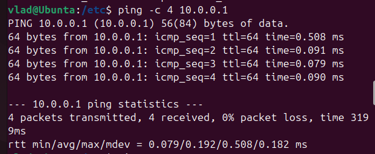
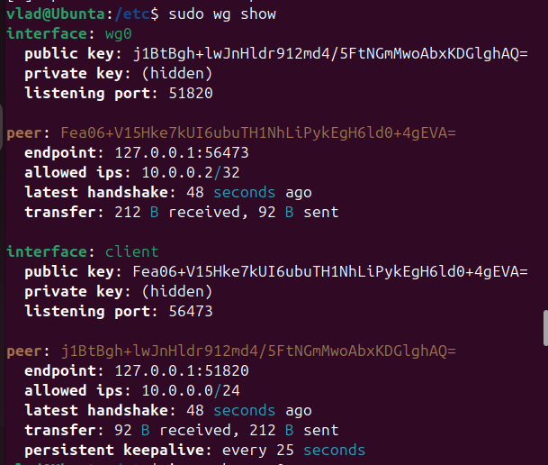

# WireGuard VPN Lab


## 📌 О проекте

Проект демонстрирует настройку WireGuard VPN-туннеля в тестовой среде. Сервер и клиент подняты на одной машине, но принцип работы идентичен реальному VPN-серверу.  
Цель — понять механизм шифрования, обмен ключами и маршрутизацию трафика через виртуальный интерфейс.

## 🛠️ Стек

- **Ubuntu 22.04** (VirtualBox)
- **WireGuard** — современный VPN-протокол

## 🔐 Как это работает

WireGuard создаёт зашифрованный туннель между двумя узлами (peer'ами). Каждый узел генерирует пару ключей:
- **Приватный ключ** — секрет, хранится на устройстве
- **Публичный ключ** — идентификатор, которым обмениваются узлы

Трафик внутри туннеля шифруется, снаружи (для провайдера или злоумышленника) — нечитаемый мусор.

## 🧩 Архитектура
[Клиент (10.0.0.2)] <--(шифрованный туннель)--> [Сервер (10.0.0.1:51820)]


## ⚙️ Что сделано

1. Установлен WireGuard
2. Сгенерированы ключи для сервера и клиента
3. Написаны конфигурационные файлы:
   - `wg0.conf` — серверная часть
   - `client.conf` — клиентская часть
4. Подняты виртуальные интерфейсы через `wg-quick`
5. Проверена связь через ping между `10.0.0.1` и `10.0.0.2`

## 🚀 Инструкция по запуску (для воспроизведения)

```bash
# 1. Установка
sudo apt update
sudo apt install wireguard -y

# 2. Генерация ключей
wg genkey | tee server_private.key | wg pubkey > server_public.key
wg genkey | tee client_private.key | wg pubkey > client_public.key

# 3. Создание конфигов (см. папку configs/)
sudo cp configs/wg0.conf /etc/wireguard/
sudo cp configs/client.conf /etc/wireguard/

# 4. Запуск
sudo wg-quick up wg0
sudo wg-quick up client

# 5. Проверка
ping -c 4 10.0.0.1
ping -c 4 10.0.0.2
```

## 📸 Результат

| Пинг между узлами | Статус интерфейсов |
|-------------------|---------------------|
|  |  |

## 📂 Структура репозитория

```
wireguard-vpn-lab/
├── configs/                # Конфигурационные файлы
│   ├── wg0.conf
│   └── client.conf
├── screenshots/            # Скриншоты работы
│   ├── ping.png
│   └── wg-show.png
├── scripts/                # Вспомогательные скрипты
│   └── generate-keys.sh
└── README.md
```

## 🧑‍💻 Автор

**ibVLAD24** — студент направления 10.05.03 "Информационная безопасность"

[](https://github.com/ibVLAD24)
